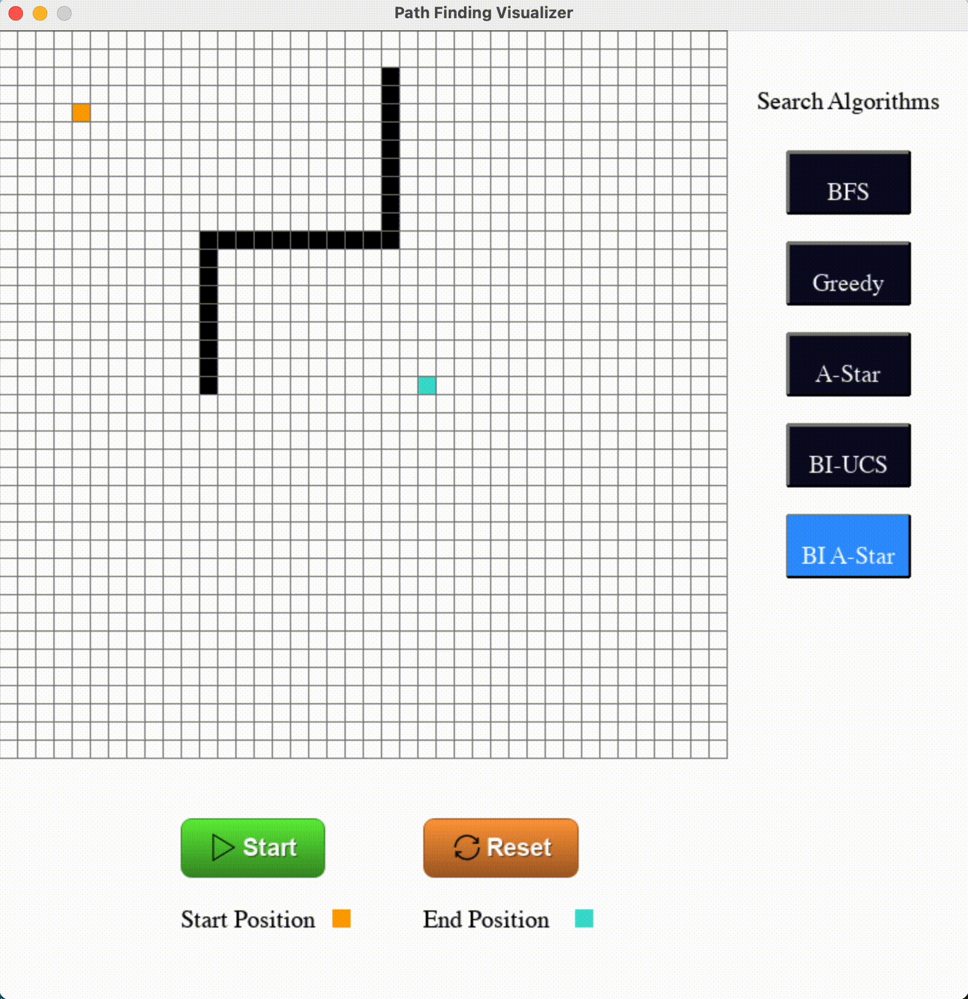

# Path Finding Visualizer with Pygame

The Path Finding Visualizer with Pygame is a Python-based desktop application that allows users to interactively visualize and understand various pathfinding algorithms. This project provides an intuitive and educational tool to explore different techniques for finding the shortest or optimal path between two points on a grid.

## Table of Contents

- [Introduction](#introduction)
- [Features](#features)
- [Supported Algorithms](#supported-algorithms)
- [Getting Started](#getting-started)
  - [Prerequisites](#prerequisites)
  - [Installation](#installation)
- [Usage](#usage)
- [How to Use](#how-to-use)
- [Contributing](#contributing)

## Introduction

Pathfinding algorithms play a crucial role in computer science for solving various problems, such as finding the shortest route or the optimal path in a grid-based environment. The Path Finding Visualizer with Pygame brings these algorithms to life by providing a visual representation of their execution process. Through interactive visualization, users can gain a deeper understanding of how these algorithms work and how different factors influence their performance.

## Features

- Interactive visualization of pathfinding algorithms using Pygame graphics.
- Multiple grid configurations to represent different maps or environments.
- Detailed explanation of each algorithm's steps.

## Supported Algorithms

The current version of the Path Finding Visualizer with Pygame supports the following pathfinding algorithms:

- Breadth-First Search (BFS)
- Greedy Search
- A* Algorithm
- Bidirectional UCS
- Bidirectional A*

## Getting Started

To run the Path Finding Visualizer with Pygame on your local machine, follow these instructions:

### Prerequisites

- Python: Make sure you have Python installed on your system.

### Installation

1. Clone this GitHub repository to your local machine or download the ZIP file and extract it.

2. Navigate to the project's root directory.

3. Install the required dependencies by running the following command:

`pip install pygame`

## Usage

1. Once you have completed the installation, run the following command to start the visualizer:

`python main.py`

2. The Pygame window will open, and you will be presented with various options to configure the algorithm settings.

3. Choose a pathfinding algorithm from the available options, configure the grid to represent your desired map or environment.

4. Press the "Start" button to watch the selected algorithm in action.

5. Observe how the algorithm explores the grid, finds the shortest or optimal path (if applicable), and how the various parameters affect the outcome.

6. You can reset the map after the process.

## How to Use

- Left-click on a cell to place start position, end position, and obstacles or walls that the algorithm cannot traverse.
- Right-click on a cell to remove obstacles or walls.
- Select a pathfinding algorithm from the menu.
- Press the "Start" button to start the algorithm's visualization process.
- Press the "Reset" button to clear the grid and start over.
- Close the Pygame window to exit the application.

## Contributing

We welcome contributions from the community to enhance the Path Finding Visualizer with Pygame. If you find any bugs, want to add new features, or improve the documentation, please feel free to open an issue or submit a pull request.

---

We hope that the Path Finding Visualizer with Pygame will be a valuable tool for anyone interested in learning about pathfinding algorithms. Have fun exploring and learning how these algorithms work! If you have any questions or feedback, don't hesitate to reach out to us. Happy pathfinding!